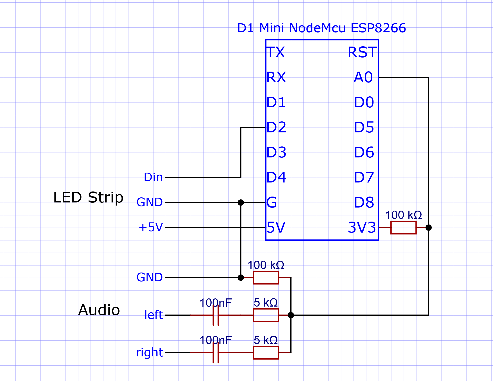

# NodeMCU LED Audio Visualizer

## Required Components
 - 1x D1 Mini NodeMCU ESP8266
 - 1x individually addressable led strip
 - 2x resistor 5 kΩ
 - 2x resistor 100 kΩ
 - 2x capacitor 100nF
 - 1x headphone jack socket
 - an [audio splitter](#splitting-the-audio)

## Schematic

## Build
I would advice to solder everything on to a circuit board.
<table>
    <tr>
        <td>
            
            
            
        </td>
    </tr>
</table>

### Splitting the Audio
You will need some kind of audio splitter to listen to the music while visualizing.
You could just use a separate splitter or add a second headphone jack to the Audio part.
For the latter you would need to connect GND, left audio and right audio of the input
as seen in the [schematic section](#schematic) to a second headphone jack.
Once you have the second jack in place you can use one as the input and one as an output.

## Running
Once the program starts the NodeMCU will start by getting some values from its analog pin to get a reference for the measured voltages.
On an Arduino Uno or Nano this is not necessary as it comes with an AREF pin used to provide a reference voltage.
Because of this you should always start the NodeMCU when connected to the playback device without any music playing.
Once the reference values are gathered the strip will light up once to show it is ready.
This can be turned off by setting `FLASH_AFTER_CALIBRATING` to `false`.