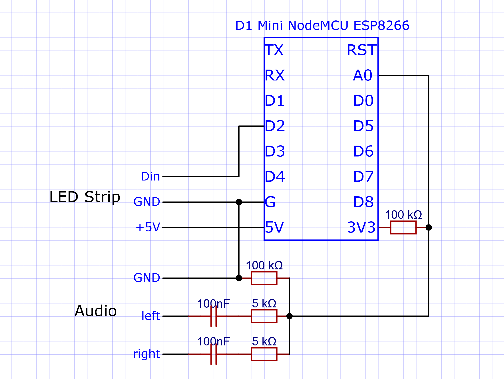

# NodeMCU LED Audio Visualizer

## Required Components
 - 1x D1 Mini NodeMCU ESP8266
 - 1x individually addressable led strip
 - 2x resistor 5 kΩ
 - 2x resistor 100 kΩ
 - 2x capacitor 100nF
 - 1x headphone jack socket

## Schematic
